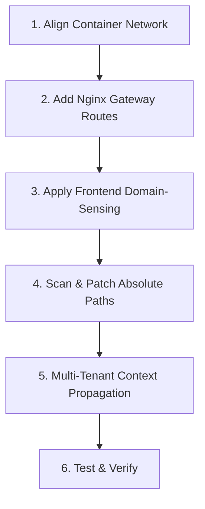
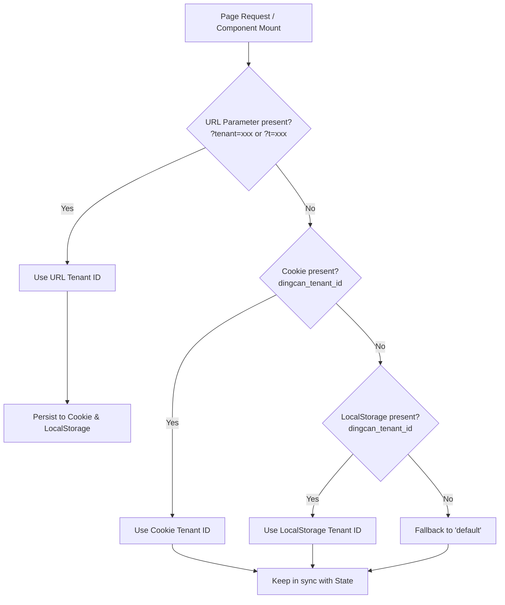

# 🚀 Single-Domain Multi-Service & Multi-Tenant Management (mysingledomain2mul)

This skill provides comprehensive architectural guidelines, production-ready templates, and troubleshooting checklists for:
1. Hosting multiple containerized microservices under a **single public entrance domain** (e.g., a single Ngrok tunnel, a public IP, or a domain) without opening additional firewall ports or paying for multiple tunnels.
2. Building robust **multi-tenant / multi-service backend administration** ensuring zero context loss across navigation, authentication, state persistence, and bidirectional frontend-backend switching.

---

## 🎨 Architectural Overview

In microservice & multi-tenant environments, different services reside in independent containers, and applications serve multiple tenants (stores, branches, departments, or clients). 
* **Local/Intranet Access**: Direct access is mapped via physical host ports (e.g., `http://192.168.1.10:7669` for Student, `http://192.168.1.10:7527` for Quality Evaluation).
* **Public/Internet Access**: Ngrok or enterprise firewalls restrict traffic to a **single entrance port/domain** (typically standard port 80/443).
* **Multi-Tenant / Sub-Service Context Isolation**: Different tenants share the same application code but require strictly segregated data, branding, tables, dishes, and orders. When administrators or customers navigate between frontend and admin panels, the active tenant context must never be accidentally lost or reverted to default.

### 💡 The Solution: Dynamic Subpath Proxying & Context-Preserved Management (双轨自适应路由与多租户全链路闭环)
1. **Shared Container Network**: All containers are bridged together (e.g., Docker network `mynet`).
2. **Reverse Proxying Gateway**: The main Nginx container (acting as the API gateway/frontend server) intercepts subpaths (e.g., `/zhpj/`) and routes them internally to the target container (e.g., `http://zhpj:3000/`) using Docker DNS resolution.
3. **Environment-Sensing Frontend**: Client-side applications dynamically detect their host domain. On public tunnels (e.g., Ngrok), they route traffic through the single-domain subpath. On local networks, they bypass the proxy and connect directly via high-speed physical ports for optimal latency.
4. **Three-Tier Zero-Loss Tenant Context**: Active tenant ID is resolved seamlessly through a cascading fallback: `URL Query Param (?tenant= / ?t=) > Cookie > LocalStorage > Default`, ensuring deep links, logins, page refreshes, and browser navigation stay synchronized.

---

## 📋 Comprehensive Integration Checklist

When integrating a new secondary service (`secondary-service`) or enhancing multi-tenant backend management, follow this checklist sequentially:



- [ ] **Step 1: Network Bridge Check**: Ensure both containers are attached to the same Docker network (e.g., `mynet`).
- [ ] **Step 2: Nginx Gateway Setup**: Add subpath, absolute page, API, and static directory proxy routes in `nginx.conf`.
- [ ] **Step 3: Frontend Navigation Setup**: Update Vue, React, or HTML click handlers to use domain-sensing URLs.
- [ ] **Step 4: Database Connection Check**: In the secondary container, ensure database hosts point to `host.docker.internal` instead of `127.0.0.1`.
- [ ] **Step 5: Path-Escape Diagnosis**: Scan for hardcoded absolute references (`/query.html`, `/api/...`, `/static/...`) that escape the subpath proxy.
- [ ] **Step 6: Multi-Tenant Context Propagation**: Verify all frontend-to-admin links carry `?tenant=xxx` instead of hardcoded `/admin`.
- [ ] **Step 7: Multi-Source State Resolution**: Ensure admin backend initializes tenant state via `URL param > Cookie > LocalStorage > Default`.
- [ ] **Step 8: Auth & Cookie Persistence Check**: Confirm `/api/admin/login` persists tenant cookie, and login card renders the targeted store's branding and in-place tenant switcher.

---

## 🛠️ Copy-Pasteable Nginx Gateway Templates

Replace these placeholder variables when configuring:
* `${SUBPATH}`: The subpath routing key (e.g., `zhpj`, `admin`).
* `${CONTAINER_NAME}`: The internal Docker container name of the target service (e.g., `zhpj`).
* `${CONTAINER_PORT}`: The port the service listens on *inside* its container (e.g., `3000`).

```nginx
# =========================================================================
# SINGLE-DOMAIN MULTI-SERVICE ROUTING TEMPLATE
# =========================================================================

# 1. Main Subpath Reverse Proxy Block
# Routes: https://domain.com/${SUBPATH}/ -> http://${CONTAINER_NAME}:${CONTAINER_PORT}/
location /${SUBPATH}/ {
    proxy_pass http://${CONTAINER_NAME}:${CONTAINER_PORT}/;
    proxy_set_header Host $host;
    proxy_set_header X-Real-IP $remote_addr;
    proxy_set_header X-Forwarded-For $proxy_add_x_forwarded_for;
    proxy_set_header X-Forwarded-Proto $scheme;
    
    # WebSocket support (highly recommended for modern frontends)
    proxy_http_version 1.1;
    proxy_set_header Upgrade $http_upgrade;
    proxy_set_header Connection "upgrade";
    
    # Timeout buffering for slow database queries or LLM wait times
    proxy_connect_timeout 300s;
    proxy_send_timeout 300s;
    proxy_read_timeout 300s;
}

# 2. Hardcoded Absolute Page Redirection Block
# Fixes: Browser accessing https://domain.com/page.html -> Redirects safely to subpath
location = /page.html {
    return 302 /${SUBPATH}/page.html;
}

# 3. Hardcoded Absolute API Proxying Block
# Fixes: Escaped AJAX calls to root https://domain.com/api/action -> Routes to secondary container
location = /api/action-name {
    proxy_pass http://${CONTAINER_NAME}:${CONTAINER_PORT}/api/action-name;
    proxy_set_header Host $host;
    proxy_set_header X-Real-IP $remote_addr;
    proxy_set_header X-Forwarded-For $proxy_add_x_forwarded_for;
    proxy_set_header X-Forwarded-Proto $scheme;
}

# 4. Hardcoded Absolute Static Folder Proxying Block
# Fixes: Escaped static file loads (PDFs, images) at https://domain.com/static/... -> Routes to container
location /static/ {
    proxy_pass http://${CONTAINER_NAME}:${CONTAINER_PORT}/static/;
    proxy_set_header Host $host;
    proxy_set_header X-Real-IP $remote_addr;
    proxy_set_header X-Forwarded-For $proxy_add_x_forwarded_for;
    proxy_set_header X-Forwarded-Proto $scheme;
}
```

---

## 💻 Multi-Framework Frontend Sensing Code Snippets

Use these environment-sensing snippets in your navigation links or buttons to support both public tunneling (Ngrok) and local/IP direct connections:

### 🟢 Vue 3 (Composition API / Setup)
```javascript
const navigateToService = () => {
  const isNgrok = window.location.hostname.includes('ngrok-free.app') || window.location.hostname.includes('ngrok.io');
  
  if (isNgrok) {
    // Public Tunnel Route (Uses same domain and protocol, routed via subpath)
    const targetUrl = `${window.location.protocol}//${window.location.host}/${SUBPATH}/`;
    window.open(targetUrl, '_blank');
  } else {
    // Local / Intranet Route (Uses direct high-speed host port mapping)
    const targetUrl = `${window.location.protocol}//${window.location.hostname}:${LOCAL_HOST_PORT}`;
    window.open(targetUrl, '_blank');
  }
}
```

### 🔵 React / TypeScript
```typescript
import React from 'react';

const handleNavigation = (): void => {
  const { hostname, protocol, host } = window.location;
  const isPublicTunnel: boolean = hostname.includes('ngrok-free.app') || hostname.includes('ngrok.io');

  const targetUrl: string = isPublicTunnel
    ? `${protocol}//${host}/${SUBPATH}/`
    : `${protocol}//${hostname}:${LOCAL_HOST_PORT}`;

  window.open(targetUrl, '_blank');
};
```

### 🟡 Plain JavaScript & HTML
```html
<button onclick="goToService()">打开服务</button>

<script>
function goToService() {
  var hostName = window.location.hostname;
  var isNgrok = hostName.indexOf('ngrok-free.app') !== -1 || hostName.indexOf('ngrok.io') !== -1;
  
  var targetUrl = isNgrok 
    ? window.location.protocol + '//' + window.location.host + '/' + SUBPATH + '/'
    : window.location.protocol + '//' + hostName + ':' + LOCAL_HOST_PORT;
    
  window.open(targetUrl, '_blank');
}
</script>
```

---

## 🏢 Multi-Tenant Backend Management & Context Synchronization (多租户后台管理与全链路上下文联动)

When managing a multi-tenant platform (or multiple microservices partitioned by tenant ID), **context loss** is one of the most frequent defects. For example:
- A user visits a branch store (`/?tenant=yue`), clicks the store name or logo to enter the admin panel, but lands on `/admin` which defaults to the primary store (`default`).
- An administrator is unaware which store they are currently authenticating into on the login screen.
- Switching stores in the admin panel does not update the browser URL or cookies, causing a page refresh to revert back to the previous store.
- Clicking "Back to Store / 前台点餐" in the admin returns to the root page (`/`) instead of the branch URL (`/?tenant=yue`).

### 1. Three-Tier Context Resolution Architecture (三级状态智能回退解析)

The application MUST resolve active tenant context following this strict priority waterfall on page initialization:



### 2. React / Next.js Production Implementation Pattern

#### (1) Lazy State Initializer (惰性函数初始化，杜绝首屏白屏或状态抖动)
```typescript
// app/admin/page.tsx
const [currentTenantId, setCurrentTenantId] = useState<string>(() => {
  if (typeof window !== 'undefined') {
    // 1. Highest priority: URL Query Parameter (?tenant=xxx or ?t=xxx)
    const p = new URLSearchParams(window.location.search);
    const queryTenant = p.get('tenant') || p.get('t');
    if (queryTenant && queryTenant.trim()) {
      return queryTenant.trim().toLowerCase();
    }
    // 2. Second priority: Cookie
    const match = document.cookie.match(/(?:^|;\s*)dingcan_tenant_id=([^;]*)/);
    if (match && match[1]) {
      try {
        const cookieVal = decodeURIComponent(match[1]).trim().toLowerCase();
        if (cookieVal) return cookieVal;
      } catch {
        // ignore
      }
    }
    // 3. Third priority: LocalStorage
    const localVal = localStorage.getItem('dingcan_tenant_id');
    if (localVal && localVal.trim()) {
      return localVal.trim().toLowerCase();
    }
  }
  return 'default';
});
```

#### (2) Unified State, URL, Cookie & Storage Synchronization (全端统一同步函数)
```typescript
const updateActiveTenant = useCallback((newTenantId: string) => {
  const cleanId = (newTenantId || 'default').trim().toLowerCase();
  setCurrentTenantId(cleanId);
  
  if (typeof window !== 'undefined') {
    // 1. LocalStorage
    try {
      localStorage.setItem('dingcan_tenant_id', cleanId);
    } catch {
      // ignore
    }
    
    // 2. Cookie (Root path, 30-day lifetime, Lax SameSite)
    document.cookie = `dingcan_tenant_id=${encodeURIComponent(cleanId)}; path=/; max-age=2592000; SameSite=Lax`;
    
    // 3. Update Browser URL without triggering full page reload
    const url = new URL(window.location.href);
    if (cleanId && cleanId !== 'default') {
      url.searchParams.set('tenant', cleanId);
    } else {
      url.searchParams.delete('tenant');
      url.searchParams.delete('t');
    }
    window.history.replaceState({}, '', url.pathname + url.search);
  }
}, []);
```

#### (3) Browser Back/Forward History Listener (浏览器前进/后退 popstate 联动)
> [!NOTE]
> Avoid calling `setState` synchronously within a generic `useEffect` on mount to sync query params, which triggers ESLint `react-hooks/set-state-in-effect`. Use the lazy initializer above for initial load, and attach a `popstate` listener for history traversal:
```typescript
useEffect(() => {
  const handlePopState = () => {
    const p = new URLSearchParams(window.location.search);
    const queryTenant = p.get('tenant') || p.get('t');
    if (queryTenant && queryTenant.trim()) {
      setCurrentTenantId(queryTenant.trim().toLowerCase());
    }
  };
  window.addEventListener('popstate', handlePopState);
  return () => window.removeEventListener('popstate', handlePopState);
}, []);
```

### 3. Login Screen Tenant Confirmation & Instant Switcher (登录界面租户提示与即时切换)

Never present an ambiguous login card. Administrators must clearly see which store they are accessing, and have the option to switch branches right on the login card:

```tsx
{/* 门店品牌与即时切换组件 */}
<div className="text-center mb-6">
  <div className="w-16 h-16 bg-amber-500 rounded-2xl flex items-center justify-center mx-auto mb-3 shadow-lg">
    {storeInfo.logo ? (
      
    ) : (
      <Store className="w-8 h-8 text-white" />
    )}
  </div>
  <h1 className="text-xl font-black text-neutral-900">{storeInfo.name}</h1>
  <p className="text-xs text-neutral-500 mt-1">{storeInfo.slogan}</p>

  {/* 门店快速切换器 */}
  {tenants.length > 0 && (
    <div className="mt-3 inline-flex items-center space-x-1.5 px-3 py-1.5 bg-amber-50/80 border border-amber-200/80 rounded-full text-xs text-neutral-800 shadow-xs">
      <Building2 className="w-3.5 h-3.5 text-amber-600 shrink-0" />
      <span className="text-[11px] text-neutral-500 shrink-0">登录门店:</span>
      <select
        id="login-tenant-select"
        value={currentTenantId}
        onChange={(e) => updateActiveTenant(e.target.value)}
        className="bg-transparent font-bold text-amber-900 border-none outline-hidden cursor-pointer text-xs pr-1"
      >
        {tenants.map((t) => (
          <option key={t.id} value={t.id}>
            {t.name} ({t.id})
          </option>
        ))}
      </select>
    </div>
  )}
</div>
```

### 4. Zero-Context-Loss Bidirectional Navigation Links (双向导航防丢参模式)

#### Frontend → Admin Navigation:
```tsx
// components/Navbar.tsx
<Link
  href={tenantId && tenantId !== 'default' ? `/admin?tenant=${encodeURIComponent(tenantId)}` : '/admin'}
  className="flex items-center space-x-2"
>
  <span className="font-bold">{restaurantName}</span>
</Link>
```

#### Admin → Frontend Return Navigation:
```tsx
// app/admin/page.tsx
<Link
  href={currentTenantId && currentTenantId !== 'default' ? `/?tenant=${encodeURIComponent(currentTenantId)}` : '/'}
  className="text-xs text-neutral-500 hover:text-neutral-800 flex items-center justify-center space-x-1.5"
>
  <Store className="w-3.5 h-3.5 text-amber-600" />
  <span>返回前台点餐页面 {currentTenantId && currentTenantId !== 'default' ? `(${storeInfo.name})` : ''}</span>
</Link>
```

### 5. Server-Side Authentication & Session Co-Persistence (服务端登录持久化绑定)

The login route (`/api/admin/login`) must accept the requested tenant ID and set a long-lived cookie so all subsequent API calls and dashboard page reloads remain attached to that tenant:

```typescript
// app/api/admin/login/route.ts
export async function POST(req: NextRequest) {
  const { username, password, tenant } = await req.json();

  if (username === 'admin' && password === 'admin123') {
    const response = NextResponse.json({
      success: true,
      message: '登录成功',
      user: { username: 'admin', role: '管理员' },
      tenant: tenant || 'default',
    });

    // 1. Session Auth Cookie
    response.cookies.set({
      name: 'restaurant_admin_auth',
      value: 'true',
      path: '/',
      httpOnly: false,
      secure: process.env.NODE_ENV === 'production',
      sameSite: 'lax',
      maxAge: 60 * 60 * 24 * 7,
    });

    // 2. Tenant Context Cookie (ensures multi-tenant persistence across sessions)
    if (tenant && typeof tenant === 'string' && tenant.trim()) {
      response.cookies.set({
        name: 'dingcan_tenant_id',
        value: tenant.trim().toLowerCase(),
        path: '/',
        httpOnly: false,
        secure: process.env.NODE_ENV === 'production',
        sameSite: 'lax',
        maxAge: 60 * 60 * 24 * 30, // 30 days
      });
    }

    return response;
  }
  return NextResponse.json({ success: false, error: '用户名或密码错误' }, { status: 401 });
}
```

### 6. Nginx Gateway Cookie Path & Subpath Header Rules (反向代理下的 Cookie 穿透与路径重写)

When running services under subpaths (e.g., `/app1/`, `/zhpj/`), ensure cookies set by upstream applications are scoped to root (`/`) or rewritten appropriately so both the gateway and subpaths can share tenant state:

```nginx
# Ensure cookies issued by upstream container apply across all subpaths
proxy_cookie_path / /;
proxy_set_header X-Forwarded-Host $host;
proxy_set_header X-Forwarded-Prefix /${SUBPATH};
```

---

## ⚠️ Critical Gotchas & Advanced Troubleshooting

### 1. Database Connection ECONNREFUSED (127.0.0.1:3306)
> [!WARNING]
> Inside a Docker container, `127.0.0.1` represents the container's isolated local loopback. Trying to connect to the host's database via `127.0.0.1` will fail immediately.
* **Fix**: Edit the secondary application's environment configuration and set the database host to **`host.docker.internal`** (or the database container's name if they share a virtual bridge).
* **Automation**: Use the bundled SSH patching script:
  ```powershell
  python scripts/diagnose_and_fix_remote.py --container <container-name> --target-host host.docker.internal
  ```

### 2. Broken Static Assets (404 Not Found)
> [!IMPORTANT]
> When loaded under `/secondary/`, a web app's HTML might request assets at `/js/main.js` (root absolute path), which will bypass the proxy and hit the gateway app's file server.
* **Fix**: Ensure the secondary app's bundler (Vite, Webpack, etc.) uses **relative paths** (`./css/` or relative links) or has a configured **base URL** (e.g., `base: '/secondary/'` in Vite).

### 3. Hardcoded Absolute API Paths (CORS or 401 Unauthorized)
> [!CAUTION]
> If a secondary app executes AJAX calls to `/api/data` from a page at `/secondary/`, the request resolves to `https://domain.com/api/data`, triggering authentication filters on the main gateway backend.
* **Fix**: Map the precise absolute API endpoint in `nginx.conf` directly to the secondary container network (as shown in the Nginx template above).

### 4. Hardcoded Absolute Assets (PDF Guides, Shared Images)
> [!NOTE]
> Static folders (like `/static/` or `/images/`) referenced from absolute paths in secondary HTML will escape the namespace and throw 404s.
* **Fix**: Map the entire folder prefix (e.g., `location /static/`) directly to the secondary container network in Nginx.

### 5. Loss of Tenant Context on Navigation (租户导航丢参与默认店回退)
> [!CAUTION]
> Hardcoding links like `<Link href="/admin">` or `<Link href="/">` destroys multi-tenant isolation because clicking them strips the active `?tenant=xxx` query parameter.
* **Fix**: Always construct dynamic links with parameter retention:
  ```tsx
  href={tenantId && tenantId !== 'default' ? `/admin?tenant=${encodeURIComponent(tenantId)}` : '/admin'}
  ```
* Ensure the recipient page reads from `URL search params` first during state initialization.

### 6. React ESLint `react-hooks/set-state-in-effect` during Query Sync (挂载阶段 Effect 同步触发渲染级联警告)
> [!WARNING]
> Calling `setCurrentTenantId(queryTenant)` synchronously inside an initial `useEffect` triggers the React compiler/ESLint rule `react-hooks/set-state-in-effect`.
* **Fix**: Use a **lazy state initializer** function `useState(() => ...)` to read `window.location.search`, `cookie`, and `localStorage` before the first render pass.
* Use a `popstate` event listener (`window.addEventListener('popstate')`) rather than an active polling effect for URL history changes.

### 7. Cookie Path Scoping in Subpath Proxies (反代子路径下的 Cookie 作用域丢失)
> [!IMPORTANT]
> If an authentication cookie or tenant cookie is set with `Path=/subpath/`, the browser will not send it when navigating to the root `/` or sibling paths.
* **Fix**: Explicitly specify `Path=/` (and `SameSite=Lax`) when calling `response.cookies.set()` or `document.cookie`, and configure `proxy_cookie_path / /;` in Nginx.

